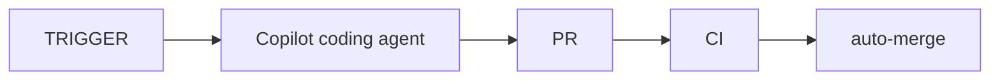

# playground

## Automation workflow

This repository uses an automated workflow for issue resolution:

The workflow is triggered automatically, creating pull requests that are validated by CI and then auto-merged when all checks pass.
